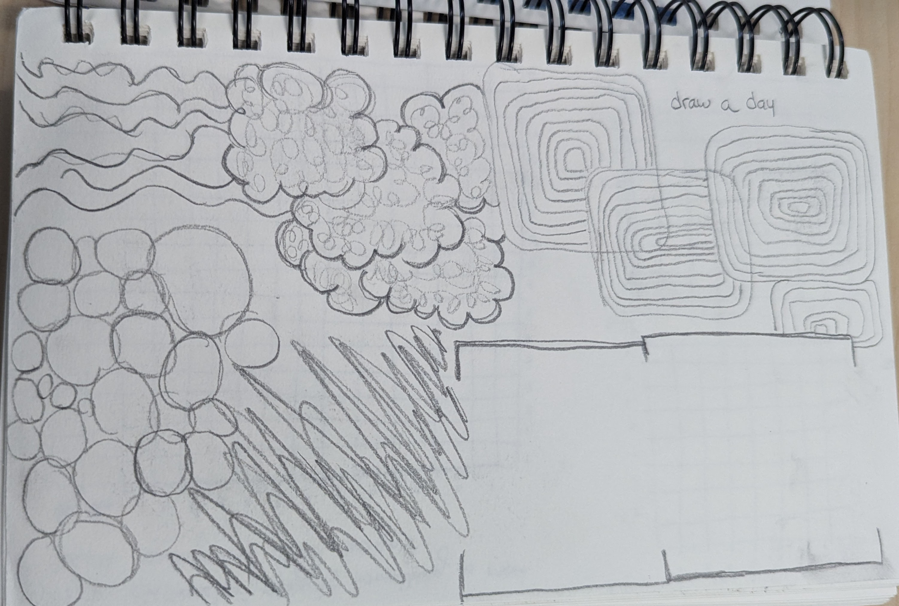

# \#11 Critical Making, and Slow Scholarship in the Age of AI
## a portolio

hii. i put this page together as part of the last exercise for course #11 of the Digital Humanities Summer Institue 2024, co-taught in-person at UVic, Canada, by Anastasia Salter and John Murray. it brings together a sample collection of the work accomplished through the 5 days that the class lasts. i hope it sparks some ideas!

here's the showcase: 
## thought/code exercises

- gris and gestures  
  <!--    -->
  

- [Twine](twine-cfractales_conceptos.html)
- [Bitsy](fix_your_power.html)
- [Taroko Gorge Remixed](toy-garbage.html)
- [P5](p5.html)
- [Tracery](tracery1st.html)

